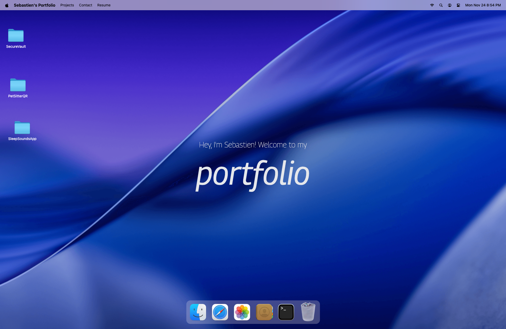

# macOS Portfolio

Interactive portfolio website that recreates the feel of the macOS Sonoma desktop. Visitors can open a dock, move draggable GSAP-powered windows, and explore projects, technical skills, blog posts, and contact info – all within a playful, desktop-style UI.



## Features

- **macOS-inspired shell** – Menu bar, welcome hero, and animated dock icons that open individual portfolio windows.
- **Draggable app windows** – Finder, Safari, Terminal, Photos, and Contact windows are powered by `gsap` + `Draggable`, complete with custom window controls handled by Zustand state.
- **Finder-based project explorer** – Custom folders and files defined in `src/constants/index.js` let you showcase work, link to repos, display images, and embed copy.
- **Blog + writing hub** – The Safari window renders external articles with hero images, metadata, and outbound links.
- **Skills terminal** – Terminal window lists categorized skills/technologies with animated glyphs, perfect for quick scanning.
- **Contact shortcuts** – Dedicated contact window surfaces your email plus quick links to GitHub, personal site, Twitter/X, and LinkedIn.

## Tech Stack

- [React 19](https://react.dev) + [Vite](https://vitejs.dev) for the SPA foundation
- [Tailwind CSS (v4 preview)](https://tailwindcss.com/blog/tailwindcss-v4-alpha) for utility-first styling
- [GSAP](https://gsap.com) + `@gsap/react` for pop-in animations and drag support
- [Zustand](https://github.com/pmndrs/zustand) + Immer middleware for window state management
- [Lucide React](https://lucide.dev) for crisp vector icons

## Getting Started

Prerequisites: Node.js 18+ and npm.

```bash
# install dependencies
npm install

# start a local dev server (http://localhost:5173)
npm run dev

# run ESLint
npm run lint

# create a production build
npm run build

# preview the production build locally
npm run preview
```

## Customizing Content

Most of the portfolio data lives in `src/constants/index.js`:

- `navLinks`, `dockApps` – control the menu and dock labels/icons.
- `locations` – powers the Finder-like explorer, including folders, files, descriptions, and external links.
- `blogPosts`, `techStack`, `socials`, `gallery` – drive the Safari, Terminal, Contact, and Photos windows.

Update the image files under `public/images` and `public/files` (or add new assets) to match your own projects. The screenshot above lives at `public/screeshots/screenshot.png`.

## Project Structure

```
src/
  components/     # Navbar, Dock, Welcome hero, shared window controls
  windows/        # Finder, Safari, Terminal, Contact, Resume, Photos, etc.
  hoc/            # WindowWrapper HOC that adds GSAP animations & draggable behavior
  store/          # Zustand stores for window and location state
  constants/      # Portfolio content configuration
public/
  files, icons, images, screeshots, macbook.png
```

Feel free to fork, remix, and deploy – just update the constants, assets, and copy to make the desktop experience your own.
